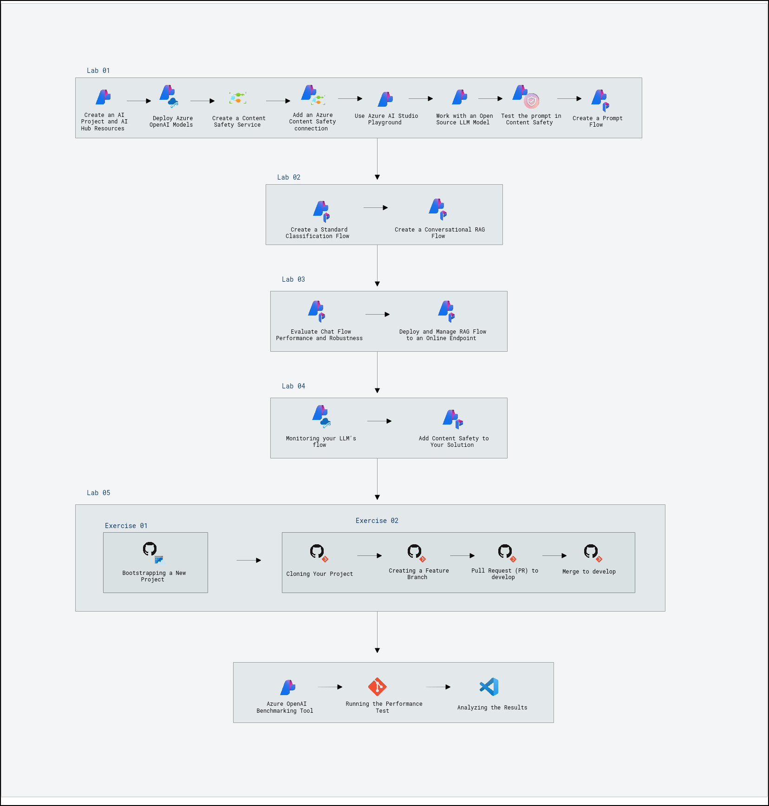
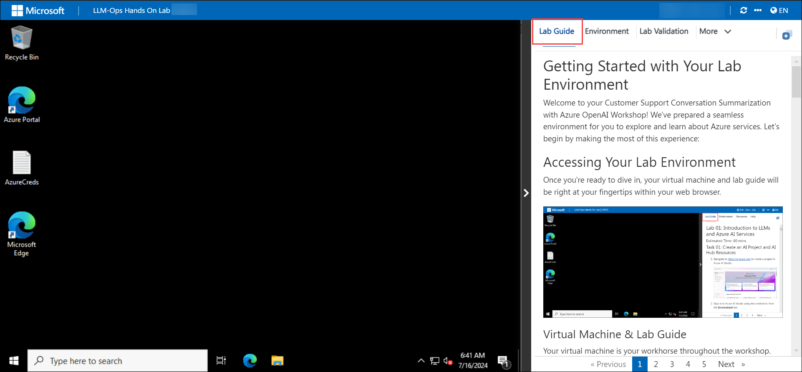

# LLM-Ops Hands-On Lab

### Overall Estimated Duration: 6 hours

## Overview

LLM-Ops involves operationalizing large language models (LLMs) to efficiently manage, scale, and refine their use in real-world applications. With Azure OpenAI, Constoso leverages LLMs like GPT-4 to enhance customer support capabilities through AI-driven solutions.

By implementing LLM-Ops with Azure OpenAI and prompt flows, Contoso effectively scales and optimizes its customer support system, enhancing automation, personalization, and knowledge management. This approach drives improved customer experiences and operational efficiency.

## Objective

The objective of these hands-on labs is to provide a comprehensive understanding of leveraging Large Language Models (LLMs) through Azure AI Services. Participants will start with an introduction to LLMs and Azure's AI capabilities, followed by the creation of orchestration flows for effectively managing and integrating these models. The labs will then cover the evaluation and deployment processes, ensuring that models are optimized and ready for production. Finally, participants will focus on monitoring the performance of LLMs and implementing responsible AI practices, addressing ethical considerations and ensuring adherence to best practices for AI deployment.

1. **Introduction to LLMs and Azure AI Services:** This hands-on aims for the participants to gain foundational knowledge of Large Language Models and Azure's AI capabilities for leveraging advanced AI solutions.

1. **Building LLMs Orchestration Flows:** This hands-on aims for the participants to learn to create and manage orchestration flows to effectively integrate and operate LLMs within applications.

1. **Evaluating and Deploying LLMs:** This hands-on aims for the participants to acquire skills to assess model performance and deploy LLMs to production environments for real-world use.

1. **Monitoring and Responsible AI:** This hands-on aims for the participants to understand how to monitor LLM performance and apply responsible AI practices to ensure ethical and effective use of AI technologies.

1. **Automating Everything:** This hands-on session guides participants in setting up a new project and overseeing the delivery of a feature, focusing on project setup, implementation, testing, and communication with stakeholders.

1. **LLM Performance Testing:** This hands-on lab guides participants through setting up, executing, and analyzing load tests on an Azure OpenAI model deployment to assess performance under different scenarios.

## Prerequisites

Participants should have: Basic knowledge and understanding of the following

- Familiarity with AI concepts and machine learning fundamentals to grasp LLM operations and their applications.
- Experience with Azure cloud services, including how to navigate the Azure portal and utilize Azure's AI and machine learning offerings.
- Basic knowledge of programming languages commonly used with AI models, such as Python, for interacting with APIs and building solutions.
- Understanding of data handling and management practices, as LLMs require data for training, evaluation, and deployment.
- Basic knowledge of responsible AI practices and ethical considerations to ensure the models are used appropriately and ethically.
- Basic knowledge of Github and how to manage GitHub repositories, branches, pull requests, GitHub CLI, and environment variables.

## Architecture

Azure AI Studio provides a comprehensive architecture for managing and deploying Large Language Models (LLMs). **Azure OpenAI Service** offers access to advanced LLMs like GPT-4 for text generation and natural language processing. **Azure Cognitive Services** integrates additional AI capabilities such as text analytics to enhance model functionality. **Azure AI Studio resources** include the **Hub** for centralized management, **Projects** for organizing AI workflows, and **Prompt Flow Types** for creating and optimizing interactions with LLMs. **Deployments** facilitate the transition of models from development to production. This integrated architecture supports building, evaluating, and managing LLMs while ensuring efficient and scalable AI solutions.

## Explanation of Components

- **Azure OpenAI Service:** Provides access to advanced language models, such as GPT-3.5, for tasks like text generation, translation, and question answering, enabling sophisticated natural language processing capabilities in applications.
- **Azure Cognitive Services:** A suite of AI services that includes various pre-built models for tasks such as language understanding, speech recognition, image analysis, and more, helping developers integrate intelligent features into their applications.
- **Azure AI Studio Resources:**
  - **Hub:** Centralized platform for managing and accessing AI resources, projects, and experiments.
  - **Project:** Workspace within Azure AI Studio for developing and managing AI models and workflows.
  - **Prompt Flows:** Tools for designing and managing prompts used in interacting with language models, allowing customization and optimization of AI responses.
  - **Deployments:** Processes and tools for deploying trained AI models into production environments, enabling their integration into real-world applications.
- **Azure Content Safety:** A suite of tools and services designed to help businesses and developers ensure that the content generated, shared, or consumed on their platforms adheres to safety, compliance, and ethical standards.

## Getting Started with Your Lab Environment
 
Welcome to your Customer Support Conversation Summarization with Azure OpenAI Workshop! We've prepared a seamless environment for you to explore and learn about Azure services. Let's begin by making the most of this experience.
 
## Accessing Your Lab Environment
 
Once you're ready to dive in, your virtual machine and lab guide will be right at your fingertips within your web browser.

  

### Virtual Machine & Lab Guide
 
 Your virtual machine is your main tool throughout the workshop. The lab guide is your roadmap to success.
 
## Exploring Your Lab Resources
 
To get a better understanding of your lab resources and credentials, navigate to the **Environment** tab.
 
  
 
## Utilizing the Split Window Feature
 
For convenience, you can open the lab guide in a separate window by clicking on the **Split Window** button in the top right corner.
 
  
 
## Managing Your Virtual Machine
 
Feel free to **start, stop, or restart (2)** your virtual machine as needed from the **Resources (1)** tab. Your experience is in your hands!

  

## Lab Validation

1. After completing a task, click on the **Validate (1)** button under the **Validation** tab integrated into your lab guide. If you receive a success message, you can proceed to the next task. If not, carefully read the error message and retry the step, following the instructions in the lab guide.

   

1. You can also **Validate (2)** the task by navigating to the **Lab Validation (1)** tab from the upper right corner of the lab guide section.

   

1. If you need any assistance, please contact us at labs-support@spektrasystems.com.

## Let's Get Started with the Azure Portal
 
1. On your virtual machine, click on the **Azure Portal (1)** icon, as shown below.
 
    

1. On the **Sign in to Microsoft Azure** tab, you will see the login screen. In that, enter the following and click on **Next**. 

   * **Email/Username**: <inject key="AzureAdUserEmail"></inject>
   
      
     
1. Next, enter the **password** and click on **Sign in**.
   
   * **Password**: <inject key="AzureAdUserPassword"></inject>
   
      

1. If you see the pop-up **Action Required**, click on **Ask Later**.

   
     
1. Select **No,** if you see the pop-up, **Stay Signed in.**

1. If you see the pop-up, **You have free Azure Advisor recommendations!** Close the window to continue the lab.

1. If a **Welcome to Microsoft Azure** pop-up window appears, select **Maybe Later** to skip the tour.

This hands-on lab will guide you through building, evaluating, monitoring, and deploying Large Language Model solutions efficiently using Azure AI, Azure Machine Learning Prompt Flow, Content Safety, and Azure OpenAI.
   
## Support Contact
 
The CloudLabs support team is available 24/7, 365 days a year, via email and live chat to ensure seamless assistance at any time. We offer dedicated support channels tailored specifically for both learners and instructors, ensuring that all your needs are promptly and efficiently addressed.

Learner Support Contacts:
- Email Support: labs-support@spektrasystems.com
- Live Chat Support: https://cloudlabs.ai/labs-support

Now, click on **Next** from the lower right corner to move on to the next page.

### Happy Learning!
