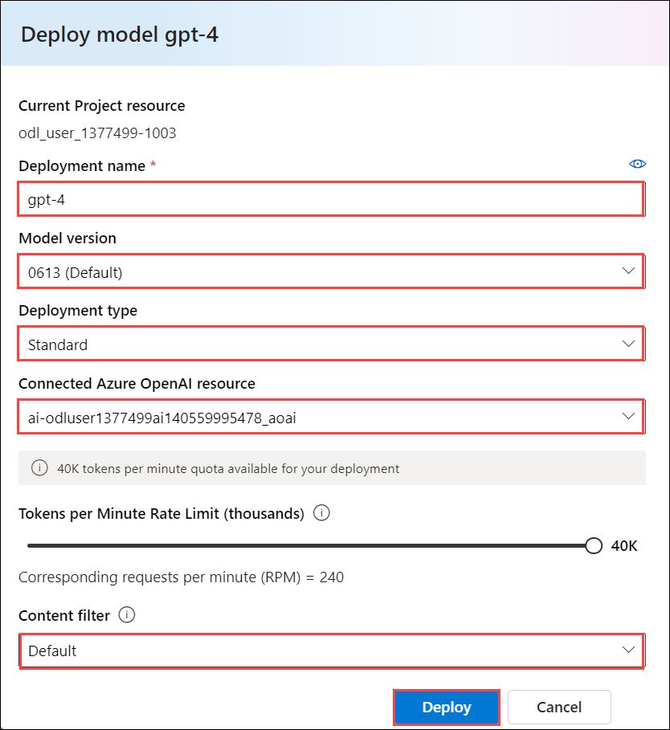

# Lab 01: Introduction to LLMs and Azure AI Services
### Estimated Time: 60 mins

## Task 01: Create an AI Project and AI Hub Resources

1. Navigate to https://ai.azure.com to create a project in Azure AI Studio.

1. Sign in to Azure AI Studio using the credentials from the **Environment** tab.

1. After logging in with your Azure account, you will see the following screen:

1. Click on **+ New Project** to create a new project and hub.

   

1. On the Project Details section, enter a unique name for your project and click on **Next**.

1. On the Create Hub section, configure the below values.

1. Click on **Create new AI Search** for the Connect Azure AI Search option. Enter the name for your Azure AI Search and click on **Create**.

   

1. On the Create Hub section, click on **Next**.

1. On the Review and finish section, review your Azure AI services, click on **Create a project** and wait for the deployments to succeed.

1. You can also navigate to your resource group in Azure portal to verify the resources deployed.

## Task 02: Deploy an Azure OpenAI Model

1. Navigate to **Components > Deployments** settings and click on **Create Deployment** to create an OpenAI model.
   
   

1. Select **gpt-4** from the list of models and click on **Confirm**.

   

1. On the *Deploy model gpt-4* pane, configure the following details and click on **Deploy**.

   

1. Verify that the **gpt-4** model is present in the Deployments section.

   

## Task 03: Create a Content Safety Service

1. Navigate to Azure portal, search for **Content Safety**.

1. On the **Azure AI Serices | Content Safety** tab, click on **+ Create**.

   

1. On the Create Content Safety **Basics** tab, configure the following resoures and click on **Next**.

   

1. On the **Identity** tab, verify that the System assigned managed identity Status is turned **On**. Click on **Review + create** and then **Create**.

   


## Task 04: Use Azure AI Studio Playground

1. In your Azure AI Studio, navigate to the **gpt-4** deployment under the Deployments settings.

1. On the **gpt-4** deployment details, click on **Open in playground**.

   

1. Let us run an example where the model will help us summarize and extract information from a conversation between a customer and a representative of a telco company.

1. Copy the following prompt into the system message field of the playground and click on **Apply changes**.

   ```
   You're an AI assistant that helps telco company to extract valuable information from their conversations by creating JSON files for each conversation transcription you receive. You always try to extract and format as a JSON:
   1. Customer Name [name]
   2. Customer Contact Phone [phone]
   3. Main Topic of the Conversation [topic]
   4. Customer Sentiment (Neutral, Positive, Negative)[sentiment]
   5. How the Agent Handled the Conversation [agent_behavior]
   6. What was the FINAL Outcome of the Conversation [outcome]
   7. A really brief Summary of the Conversation [summary]

   Only extract information that you're sure. If you're unsure, write "Unknown/Not Found" in the JSON file.
   ```
   
   >**Note:** If you receive a *Update systems message?* pop-up, enable the **Do not show this again** and click on **Continue**.

   
   
1. Copy the following text in the chat session and click the send button.

   ```
   Agent: Hello, welcome to Telco's customer service. My name is Juan, how can I assist you?
   Client: Hello, Juan. I'm calling because I'm having issues with my mobile data plan. It's very slow and I can't browse the internet or use my apps.
   Agent: I'm very sorry for the inconvenience, sir. Could you please tell me your phone number and your full name?
   Client: Yes, sure. My number is 011-4567-8910 and my name is Martín Pérez.
   Agent: Thank you, Mr. Pérez. I'm going to check your plan and your data usage. One moment, please.
   Client: Okay, thank you.
   Agent: Mr. Pérez, I've reviewed your plan and I see that you have contracted the basic plan of 2 GB of data per month. Is that correct?
   Client: Yes, that's correct.
   Agent: Well, I inform you that you have consumed 90% of your data limit and you only have 200 MB available until the end of the month. That's why your browsing speed has been reduced.
   Client: What? How is that possible? I barely use the internet on my cell phone. I only check my email and my social networks from time to time. I don't watch videos or download large files.
   Agent: I understand, Mr. Pérez. But keep in mind that some applications consume data in the background, without you realizing it. For example, automatic updates, backups, GPS, etc.
   Client: Well, but they didn't explain that to me when I contracted the plan. They told me that with 2 GB I would have enough for the whole month. I feel cheated.
   Agent: I apologize, Mr. Pérez. It was not our intention to deceive you. I offer you a solution: if you want, you can change your plan to a higher one, with more GB of data and higher speed. This way you can enjoy a better browsing experience.
   Client: And how much would that cost me?
   Agent: We have a special offer for you. For only 10 pesos more per month, you can access the premium plan of 5 GB of data and 4G speed. Are you interested?
   Client: Mmm, I don't know. Isn't there another option? Can't you give me more speed without charging me more?
   Agent: I'm sorry, Mr. Pérez. That's the only option we have available. If you don't change your plan, you'll have to wait until next month to recover your normal speed. Or you can buy an additional data package, but it would be more expensive than changing plans.
   Client: Well, let me think about it. Can I call later to confirm?
   Agent: Of course, Mr. Pérez. You can call whenever you want. The number is the same one you dialed now. Is there anything else I can help you with?
   Client: No, that's all. Thank you for your attention.
   Agent: Thank you, Mr. Pérez. Have a good day. Goodbye.
   ```

   

1. You will see a result generated by the model similar to the one shown in the image below. Notice that the model correctly followed the instructions indicated in the System message field.

   ```
   {
   "name": "Martín Pérez",
   "phone": "011-4567-8910",
   "topic": "Mobile data plan issues",
   "sentiment": "Negative",
   "agent_behavior": "Polite and helpful, offered solutions",
   "outcome": "Client is considering options, will call back later",
   "summary": "Client Martín Pérez called to complain about slow mobile data. Agent explained that he had almost reached his data limit for the month, causing the reduced speed. The agent suggested upgrading his plan for better service, but the client was unsure and said he would think about it and call back later."
   }
   ```
   
   
   
## Task 05: Work with an Open Source LLM Model

1. Now let's test an open source Llama2 model from Meta. Navigate to **Components > Deployments** settings and click on **Create Deployment** to create an OpenAI model.

1. Search for and select **Llama-2-13b-chat** from the list of models and click on **Confirm**.

1. On the Deployments options tab, click on **Serverless API with Azure AI Content Safety**.

1. On the **Serverless API deployment for Llama-2-13b-chat** tab, select your project and click on **Subscribe and Deploy**.


